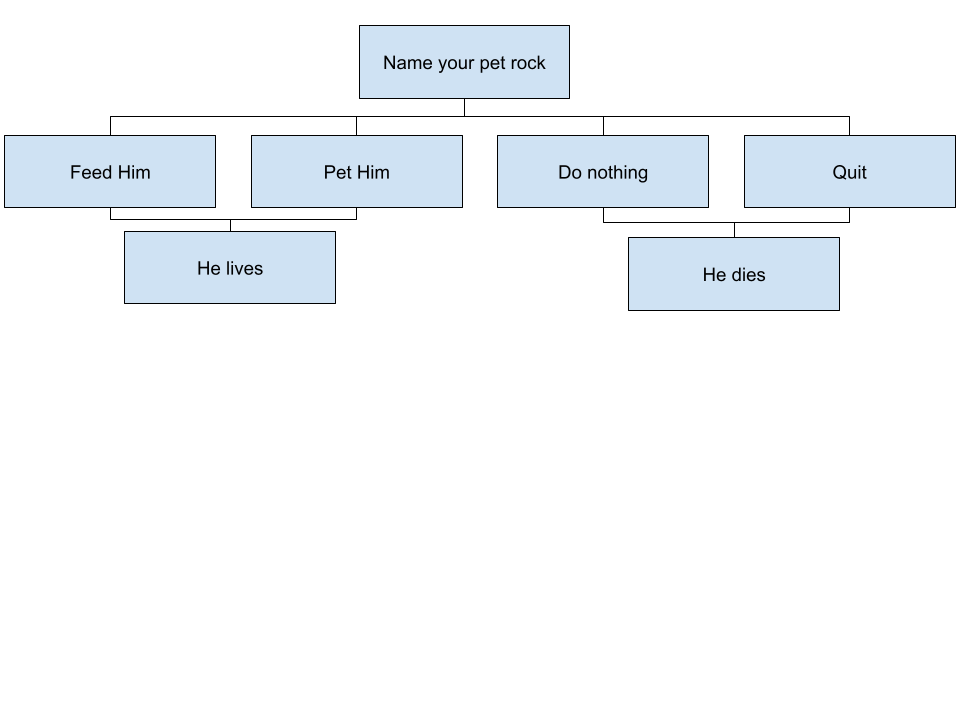

[](https://classroom.github.com/a/3zOHVIfr)



# Pet Rock Simulator
You get to name your rock and, you'll either feed or pet or rock or it dies!

 


## Requirements
* Python 3.x
* A keyboard

## Features
* You get to take care of a rock!

## Examples

Basic usage:

```bash
python3 pet_rock.py
```
## License
This project is public domain.